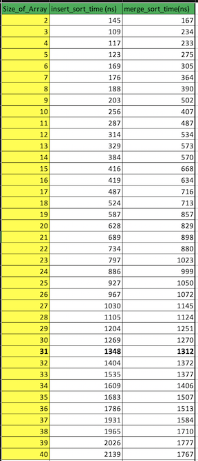
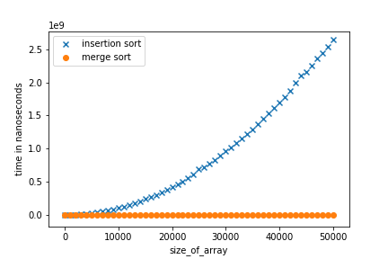
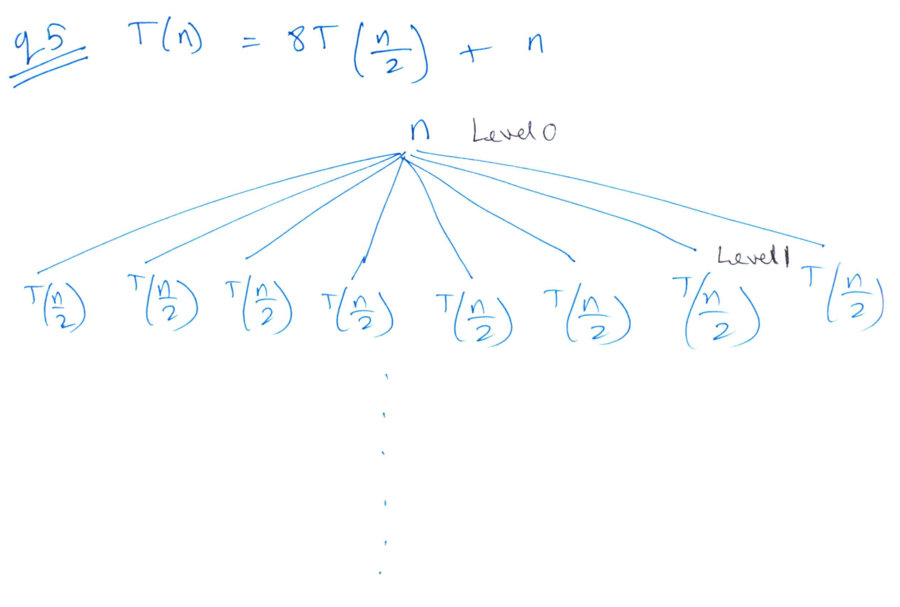

__**Answer 1**__

Entire working program-

```
#include "iostream"
#include <chrono>

using namespace std;
using namespace std::chrono;

void print_array(int *A,int size_of_array){
  /*
  Helper function
  Takes in array A of size size_of_array and prints the contents
  */
  for (int i=0;i<size_of_array;i++){
    cout<<A[i]<<" ";
  }
  cout<<endl;
}

void insertion_sort(int *A,int size_of_array){
  /*
  Takes in array A of size size_of_array and sorts via insertion_sort
  */
  int i,key;
  for (int j=1;j<size_of_array;j++){
    i=j-1;
    key=A[j];
    while (key<A[i] & i>-1) {
      A[i+1]=A[i];
      i=i-1;
    }
    A[i+1]=key;
  }
}

void merge(int *A,int l,int mid, int r){
  /*
  A[l:mid] is sorted,
  A[mid+1:r] is sorted
  */
  int n1=mid-l+1;
  int n2=r-mid;
  int left[n1];
  int right[n2];

  for (int i=0;i<n1;i++){
    left[i]=A[l+i];
  }

  for (int j=0;j<n2;j++){
    right[j]=A[mid+j+1];
  }
  int i=0;
  int j=0;
  int k=l;
  while (i<n1 & j<n2){
    if (left[i]<right[j]){
      A[k]=left[i];
      i=i+1;
    }
    else{
      A[k]=right[j];
      j=j+1;
    }
    k=k+1;
  }

  while (i<n1){
    A[k]=left[i];
    k=k+1;
    i=i+1;
  }

  while (j<n2){
    A[k]=right[j];
    k=k+1;
    j=j+1;
  }
}

void merge_sort(int *A,int l,int r){
  /*
  Input: A[l...r].
  Initial call: l=0, r=len(A)-1.
  If len(A)==1, "if" condition at start would be false, and merge_sort would return A directly
  */
  int mid;
  if (l<r){
    mid=(int)(l+r-1)/2;
    merge_sort(A,l,mid);
    merge_sort(A,mid+1,r);
    merge(A,l,mid,r);
  }
}

auto time_insertion_sort(int size_of_array){
  /*
  create array of size size_of_array, sorted in descending order - which is the worst case for insertion_sort
  call insertion_sort() and wrap the timing functions around it. return the time taken by insertion sort
  */
  int A[size_of_array];
  for (int j=size_of_array;j>0;j--){
    A[size_of_array-j] = j;
  }
  //print_array(A,size_of_array);
  //cout<<"Insertion Sort ";
  auto start = high_resolution_clock::now();
  insertion_sort(A,size_of_array);
  auto stop = high_resolution_clock::now();
  auto duration = duration_cast<nanoseconds>(stop - start);
  //cout << "time "<<duration.count() << " ns"<<endl;
  //print_array(A,size_of_array);
  return duration;
}

auto time_merge_sort(int size_of_array){
  /*
  create array of size size_of_array, sorted in descending order.
  call merge_sort() and wrap the timing functions around it. return the time taken by merge sort
  */

  int B[size_of_array];
  for (int j=size_of_array;j>0;j--){
    B[size_of_array-j] = j;
  }
  //print_array(B,size_of_array);
  //cout<<"Merge Sort ";
  auto start = high_resolution_clock::now();
  merge_sort(B,0,size_of_array-1);
  auto stop = high_resolution_clock::now();
  auto duration = duration_cast<nanoseconds>(stop - start);
  //cout << "time "<<duration.count() << " ns"<<endl;
  //print_array(B,size_of_array);
  return duration;
}
int main() {
  cout<<"size_of_array"<<"\t"<<"insert sort time"<<"\t"<<"merge sort time"<<endl;

  for (int size_of_array=2;size_of_array<50;size_of_array=size_of_array+1){
    auto insert_time=time_insertion_sort(size_of_array); // time taken by insertion sort
    auto merge_time=time_merge_sort(size_of_array); // time taken by merge sort
    cout<<size_of_array<<"\t"<<insert_time.count()<<"\t"<<merge_time.count()<<endl;
  }
  return 0;
}

```


Insertion sort code-
```
void insertion_sort(int *A,int size_of_array){
  /*
  Takes in array A of size size_of_array and sorts via insertion_sort
  */
  int i,key;
  for (int j=1;j<size_of_array;j++){
    i=j-1;
    key=A[j];
    while (key<A[i] & i>-1) {
      A[i+1]=A[i];
      i=i-1;
    }
    A[i+1]=key;
  }
}
```

Merge sort code-
```
void merge(int *A,int l,int mid, int r){
  /*
  A[l:mid] is sorted,
  A[mid+1:r] is sorted
  */
  int n1=mid-l+1;
  int n2=r-mid;
  int left[n1];
  int right[n2];

  for (int i=0;i<n1;i++){
    left[i]=A[l+i];
  }

  for (int j=0;j<n2;j++){
    right[j]=A[mid+j+1];
  }
  int i=0;
  int j=0;
  int k=l;
  while (i<n1 & j<n2){
    if (left[i]<right[j]){
      A[k]=left[i];
      i=i+1;
    }
    else{
      A[k]=right[j];
      j=j+1;
    }
    k=k+1;
  }

  while (i<n1){
    A[k]=left[i];
    k=k+1;
    i=i+1;
  }

  while (j<n2){
    A[k]=right[j];
    k=k+1;
    j=j+1;
  }
}

void merge_sort(int *A,int l,int r){
  /*
  Input: A[l...r].
  Initial call: l=0, r=len(A)-1.
  If len(A)==1, "if" condition at start would be false, and merge_sort would return A directly
  */
  int mid;
  if (l<r){
    mid=(int)(l+r-1)/2;
    merge_sort(A,l,mid);
    merge_sort(A,mid+1,r);
    merge(A,l,mid,r);
  }
}
```

* Input has a been set a sequence in decreasing order, which is the worst case for insertion sort

* Input size n for which merge sort starts to beat insertion sort in terms of the worst-case running time-> n=31



Asymptotically, merge sort beats insertion sort-


__**Answer 2**__<br/>
$A=[10,5,7,9,8,3]$<br/>
<u>Arrangement of array for iterations of insertion sort</u><br/>
$A=[10,5,7,9,8,3]$
$A=[5,10,7,9,8,3]$
$A=[5,7,10,9,8,3]$
$A=[5,7,9,10,8,3]$
$A=[5,7,8,9,10,3]$
$A=[3,5,7,8,9,10]$

<u>Arrangement of array for iterations of partition</u><br/>

First element of the array has been chosen as pivot in every iteration here. The algorithm can be easily modified to randomized quicksort by choosing the partition element randomly in each iteration

$ [10, 5, 7, 9, 8, 3] \hspace{.5cm}i=  0 \hspace{.5cm}j=  1 $
$ [10, 5, 7, 9, 8, 3] \hspace{.5cm}i=  1 \hspace{.5cm}j=  2 $
$ [10, 5, 7, 9, 8, 3] \hspace{.5cm}i=  2 \hspace{.5cm}j=  3 $
$ [10, 5, 7, 9, 8, 3] \hspace{.5cm}i=  3 \hspace{.5cm}j=  4 $
$ [10, 5, 7, 9, 8, 3] \hspace{.5cm}i=  4 \hspace{.5cm}j=  5 $
$ [3, 5, 7, 9, 8, 10] \hspace{.5cm}i=  0 \hspace{.5cm}j=  1 $
$ [3, 5, 7, 9, 8, 10] \hspace{.5cm}i=  0 \hspace{.5cm}j=  2 $
$ [3, 5, 7, 9, 8, 10] \hspace{.5cm}i=  0 \hspace{.5cm}j=  3 $
$ [3, 5, 7, 9, 8, 10] \hspace{.5cm}i=  0 \hspace{.5cm}j=  4 $
$ [3, 5, 7, 9, 8, 10] \hspace{.5cm}i=  1 \hspace{.5cm}j=  2 $
$ [3, 5, 7, 9, 8, 10] \hspace{.5cm}i=  1 \hspace{.5cm}j=  3 $
$ [3, 5, 7, 9, 8, 10] \hspace{.5cm}i=  1 \hspace{.5cm}j=  4 $
$ [3, 5, 7, 9, 8, 10] \hspace{.5cm}i=  2 \hspace{.5cm}j=  3 $
$ [3, 5, 7, 9, 8, 10] \hspace{.5cm}i=  2 \hspace{.5cm}j=  4 $
$ [3, 5, 7, 9, 8, 10] \hspace{.5cm}i=  3 \hspace{.5cm}j=  4 $

__**Answer 3**__
$n+3\in \Omega(n)$          **True**
$n+3\in O(n^2)$        **True**
$n+3\in \theta(n^2)$           **False**
$2^{n+1}\in O(n+1)$    **False**
$2^{n+1}\in\theta(2^n)$          **True**

__**Answer 4**__

$T(n) = 8*T(\frac n2)+n = \theta(n^3)$
$T(n) = 8*T(\frac n2)+n^2 = \theta(n^3)$
$T(n) = 8*T(\frac n2)+n^3 = \theta(n^3*\log n)$
$T(n) = 8*T(\frac n2)+n^4 = \theta(n^4)$

__**Answer 5**__

 <center><u>Recursion tree</center></u>



* Total levels = $\log_2n+1$
* At level $j$ ->  $8^j$ subproblems each of size $n/2^j$
* Computation at level j= $c*(8^j) * (n/2^j$)<br/>= $c* (n)* (4^j)$<br/><br/>
* Total computation across all levels= $\sum_{j=0}^{log_2n}c* (n)* (4^j)$<br/>
= $c* (n)*\sum_{j=0}^{log_2n}* (4^j)$( This is a geometric progression)<br/>
= $c* (n)* (4^{(log_2n+1)}-1)/(4-1) $<br/>
= $c1*(n*(4^{(log_2n+1)}-1))$<br/>= $c1*(n*(4*4^{(log_2n)})-n))$<br/>= $c1*(4*(n*n^{(log_24)})-n))$<br/>= $c1*(4*(n^3)-n))$<br/>= $O(n^3)$ 
<br/>

 
<center><u>Substitution method</center></u>

* Given: $T(n) = 8*T(\frac n2)+n$
Let the guess for $T(n)$ be $T(n)\leq c1*n^3-c2*n$
  * that is $O(n^3)$

* The substitution method requires us to prove that $T(n) \leq c1*n^3-c2*n$ for an appropriate choice of the constant c1 > 0 and c2>0 valid $\forall \hspace{.15cm} n>n_0$

* We start by assuming that this bound holds for all positive m < n, in particular for m=n/2, yielding      
$T(\frac n2) \leq c1*({\frac n2})^3 - c2*\frac n2. $
* Substituting into the recurrence yields      
$T(n) \leq 8*c1*({\frac n2})^3-8*c2*{\frac n2}+n$
$T(n) \leq c1*(n)^3-4*c2*n+n$
$T(n) \leq c1*(n)^3-c2*n-(3*c2*n-n)$
Residue=$(3*c2*n-n)$; must be positive
True for $c2>1/3$
* Base case
T(1)=1
T(2)=10
Also, $T(2)<= c1*8-c2*2$
True if c1>>c2. Example. c2=1, c1=10

Therefore, $T(n) = O({n})^3$


<div align="right">
<b>
QED
</b>
</div>
