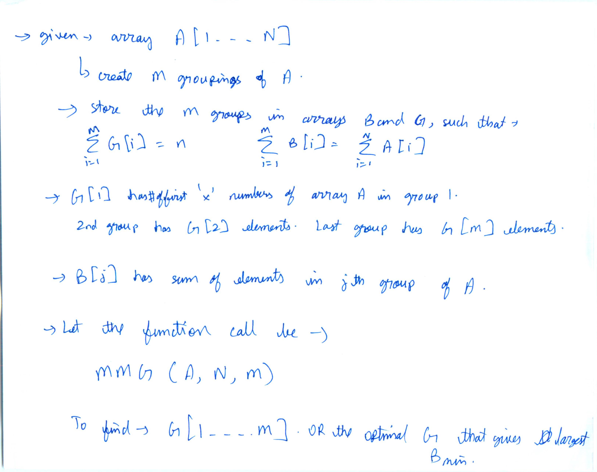
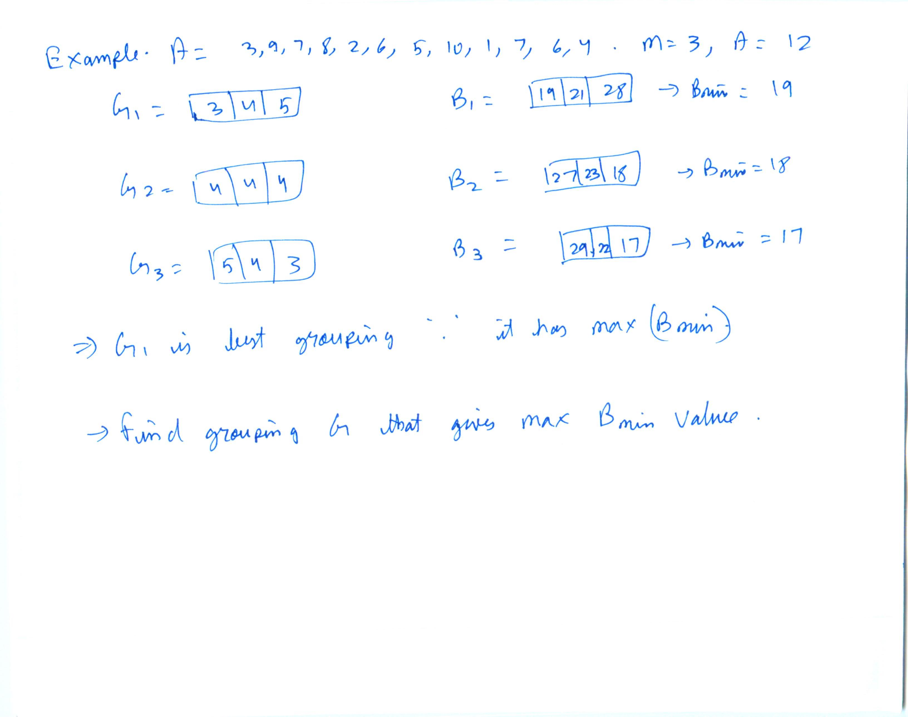
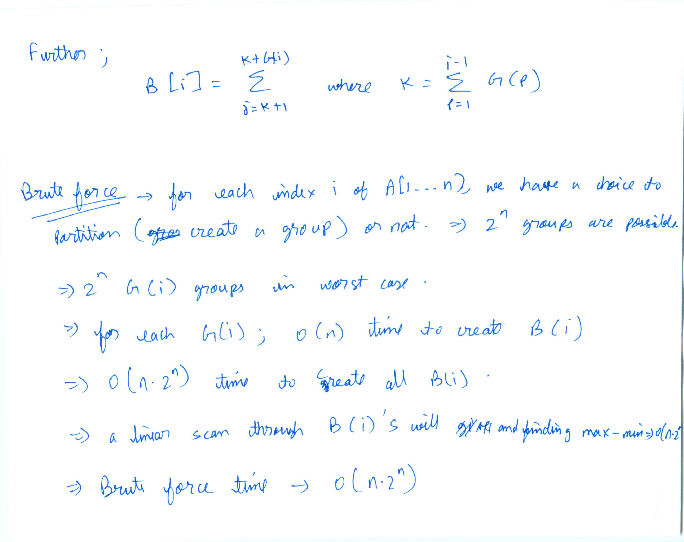
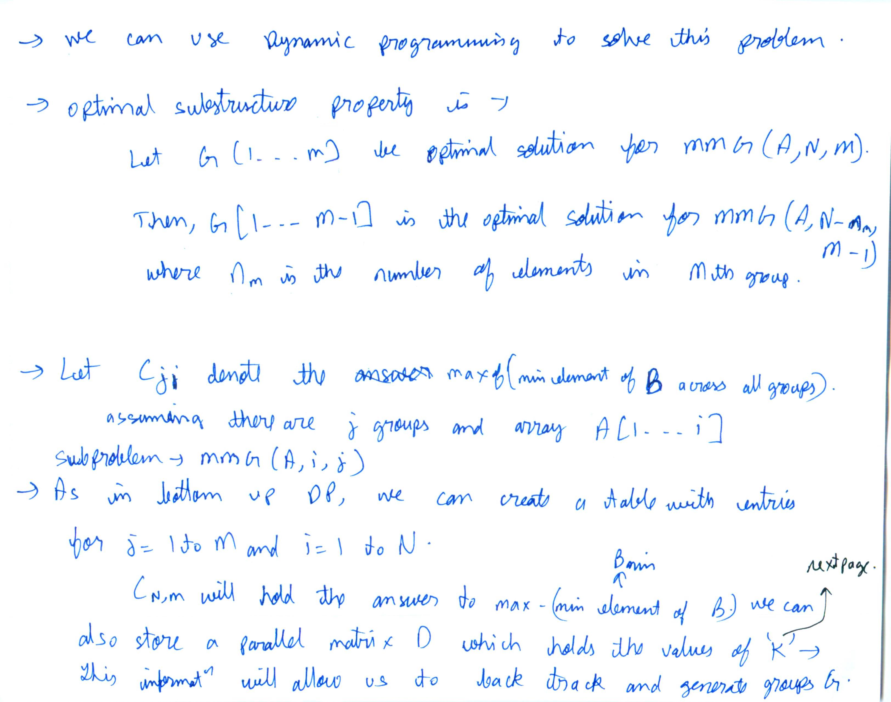
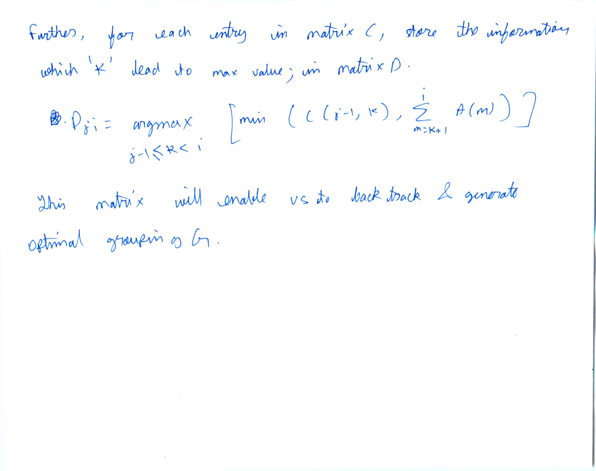
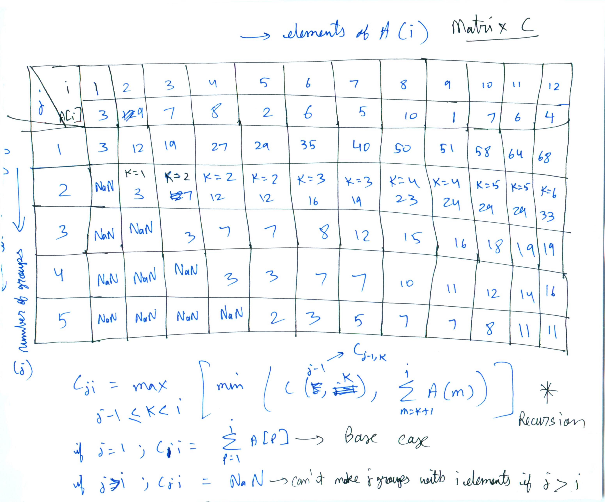
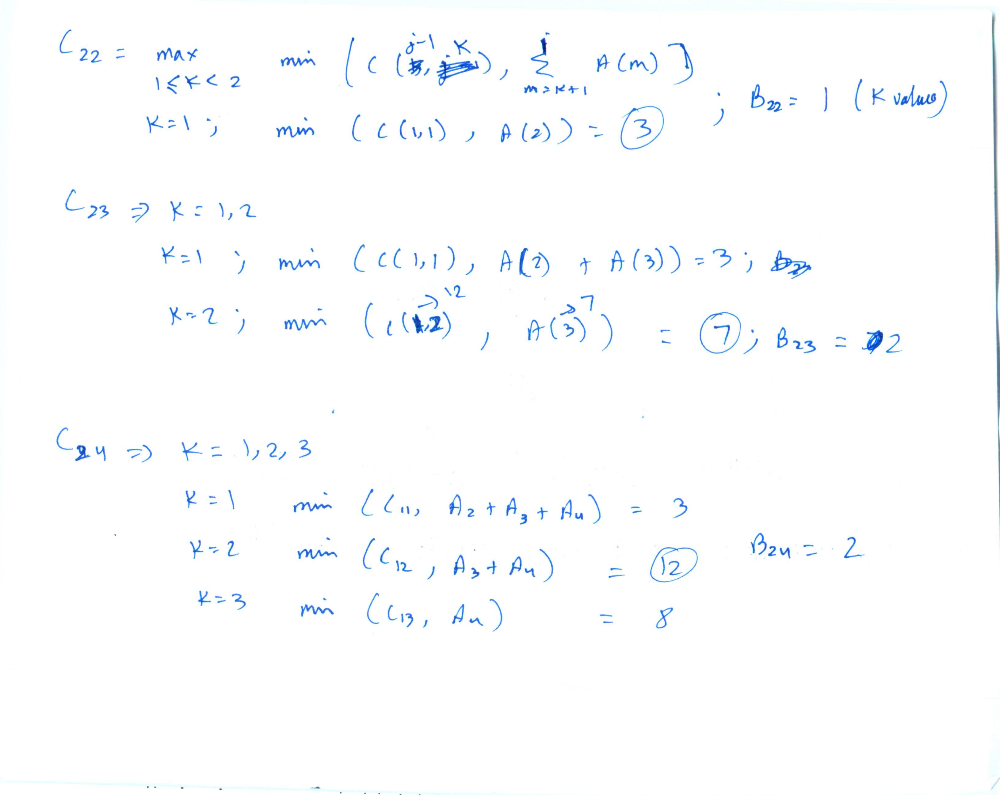
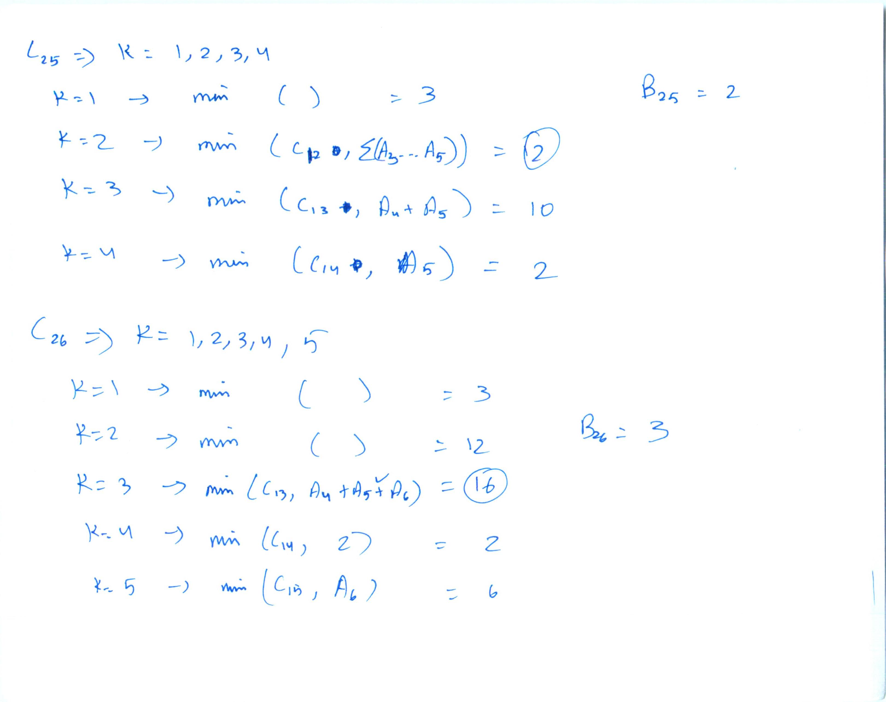
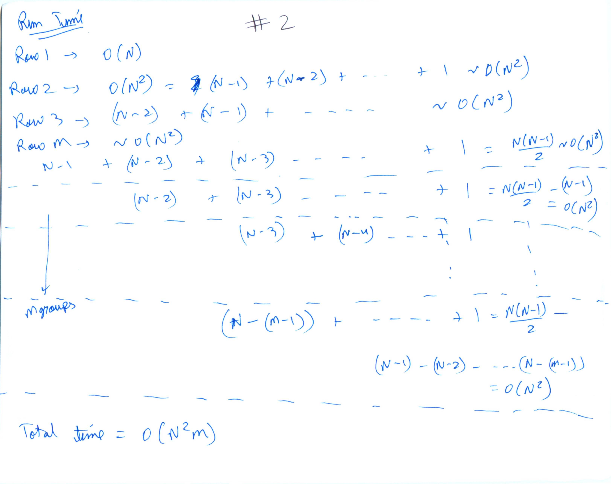

## Project 1










#### Pseduocode
```
// array indexing from 0 for all arrays
// initialize G as a 1D matrix of size M with 0's
// initialize C as a 2D matrix of size NxM with 0's
// C stores max(Bmin) for every row, column (i,j)
// initialize B as a 2D matrix of size NxM with -1's
// B stores k values that give max(Bmin)
// sum(A[k+1.....i]) is sum of elements of A from index k+1 to i


def Max_Min_Grouping(self,A,N,M):
    C[0][0]=A[0]
    for i in 1 to N-1: // fill 1st row of C
        C[0][i]=A[i]+C[0][i-1]
    // fill rest of the C table based on recursion formula. Also update B
    for j in 1 to M-1:
        for i in j to N-1:
            best_val=-infinity
            arg_max=-1
            for k in j-1 to i-1:
                current_val=min(C[j-1][k],sum(A[k+1.....i])
                if current_val>best_val:
                    best_val=current_val
                    arg_max=k
            C[j][i]=best_val
            B[j][i]=arg_max
    // Use the values in B to get optimal grouping G
    column=N-1
    m=M
    while(m>0):
        m=m-1
        G[m]=column-B[m][column]
        column=B[m][column]
    return G
```

#### Run time




* To fill every row of table C, it takes O(N^2) time (as elaborated above)
*  There are M rows in table C. Total time taken is O(M*N^2)

####  Grouping results of several input examples
input vector is : 3 9 7 8 2 6 5 10 1 7 6 4
M is 3 and N is 12
optimal grouping is : 3 4 5

-------------------------------

input vector is : 3 9 7 8 2 6 5 10 1 7 6 4
M is 4 and N is 12
optimal grouping is : 3 3 3 3

-------------------------------


input vector is : 3 9 7 8 2 6 5 10 1 7 6 4
M is 5 and N is 12
optimal grouping is : 2 2 3 2 3

-------------------------------


input vector is : 3 9 7 8 2 6 5 10 1 7 6 4
M is 6 and N is 12
optimal grouping is : 2 2 3 1 2 2

-------------------------------


input vector is : 7 9 2 5 8 5 3 21 3 6 8
M is 3 and N is 11
optimal grouping is : 3 3 5

-------------------------------


input vector is : 7 9 2 5 8 5 3 21 3 6 8
M is 5 and N is 11
optimal grouping is : 2 3 2 1 3

-------------------------------


input vector is : 7 9 2 5 8 5 3 21 3 6 8
M is 7 and N is 11
optimal grouping is : 1 1 2 1 2 1 3

-------------------------------


input vector is : 7 9 2 5 8 5 3 21 3 6 8
M is 4 and N is 8
optimal grouping is : 2 3 2 1

-------------------------------


input vector is : 7 9 2 5 8 5 3 21 3 6 8
M is 3 and N is 8
optimal grouping is : 3 3 2

#### Code

```
// Run command-
// g++ -std=c++11 sol1.cpp -o solution.out && ./solution.out

#include <vector>
#include <stdio.h>
#include <assert.h>
#include <iostream>
using namespace std;
void print_1D_vector(vector<int> v){
  //helper function to print 1D vector
  for (int i=0;i<v.size();i++){
    cout<<v[i]<<" ";
  }
  cout<<endl;
}

void print_2D_vector(vector<vector<int>> const &v) {
  //helper function to print 2D vector
  for (vector<int> row: v) {
    for (int val: row) {
      cout << val << " ";
    }
    cout << '\n';
  }
}


int sum(vector<int> A,int start,int stop){
  //helper function to sum elements of array A[start....stop]
  int sum=0;
  for (int i=start;i<=stop;i++){
    sum=sum+A[i];
  }
  return sum;
}


vector<int> Max_min_grouping(vector<int> A,int N,int M){
  // 2D vector C to store max(Bmin) for every row, coloumn (i,j)
  vector<vector<int>> C(M, vector<int>(N, 0));
  // 2D vector B to store k values that gave max(Bmin). Will help to backtrack and get
  // the optimal G grouping
  vector<vector<int>> B(M, vector<int>(N, -1));
  // fill 1st row of C
  C[0][0]=A[0];
  for (int i=1;i<N;i++){
    C[0][i]=A[i]+C[0][i-1];
  }
  // fill rest of the C table based on recursion formula. Also update B with appropriate k values
  for (int j=1;j<M;j++){
    for (int i=j;i<N;i++){
      int best_val=-1000;
      int arg_max=-1;
      for (int k=j-1;k<i;k++){
        int current_val=min(C[j-1][k],sum(A,k+1,i));
        if (current_val>best_val){
          best_val=current_val;
          arg_max=k;
        }
      }
      C[j][i]=best_val;
      B[j][i]=arg_max;
    }
  }
  // Initialize 1D vector G. This shall be final optimal grouping
  vector<int> G(M, 0);
  // Use the values in B to get optimal grouping G
  int column=N-1;
  int m=M;
  while(m>0){
    m=m-1;
    G[m]=column-B[m][column];
    column=B[m][column];
  }
  // To further test, uncomment the below lines and check the values of matrix C and B
  //print_2D_vector(C);
  //cout <<endl<<endl;
  //print_2D_vector(B);
  //cout <<endl<<endl;
  return (G);
}

void run_MMG(vector<int> v,int N,int M){
  assert (N<=v.size());
  // helper function to call the function Max_min_grouping, print input parameters and final result
  cout <<"Input array is : ";
  print_1D_vector(v);
  vector<int> G=Max_min_grouping(v,N,M);
  cout <<"M is "<<M<<" and N is "<< N<<endl;
  cout <<"Optimal grouping is : ";
  print_1D_vector(G);
  cout<<endl<<endl;
}

void pre_defined_test_cases(){
  vector<int> v;
  v={3,9,7,8,2,6,5,10,1,7,6,4};
  run_MMG(v,12,3);

  v={3,9,7,8,2,6,5,10,1,7,6,4};
  run_MMG(v,12,4);


  v={3,9,7,8,2,6,5,10,1,7,6,4};
  run_MMG(v,12,5);

  v={3,9,7,8,2,6,5,10,1,7,6,4};
  run_MMG(v,12,6);


  v={7,9,2,5,8,5,3,21,3,6,8};
  run_MMG(v,11,3);


  v={7,9,2,5,8,5,3,21,3,6,8};
  run_MMG(v,11,5);


  v={7,9,2,5,8,5,3,21,3,6,8};
  run_MMG(v,11,7);

  v={7,9,2,5,8,5,3,21,3,6,8};
  run_MMG(v,8,4);

  v={7,9,2,5,8,5,3,21,3,6,8};
  run_MMG(v,8,3);
}


int main(int argc, char const *argv[]) {
  // uncomment below line to run some predefined test cases
  // pre_defined_test_cases();
  vector<int> v;
  int input;
  int M;
  int N;
  cout <<"Enter N (size of array to be considered) \n";
  cin >> N;
  cout <<"Enter M (number of groups) \n";
  cin >> M;
  cout<<"Enter array A : \n";
  for (int i=0;i<N;i++){
    cin>>input;
    v.push_back(input);
  }

  run_MMG(v,N,M);

  return 0;
}

```
